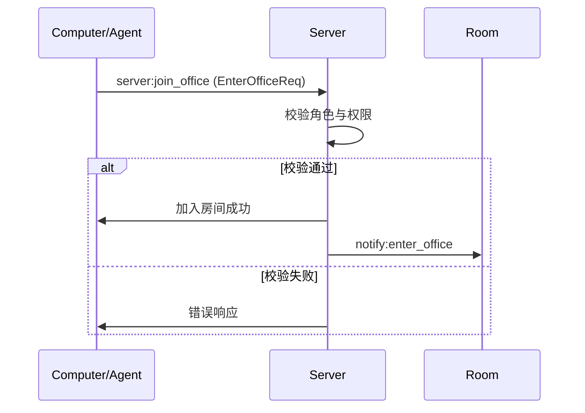
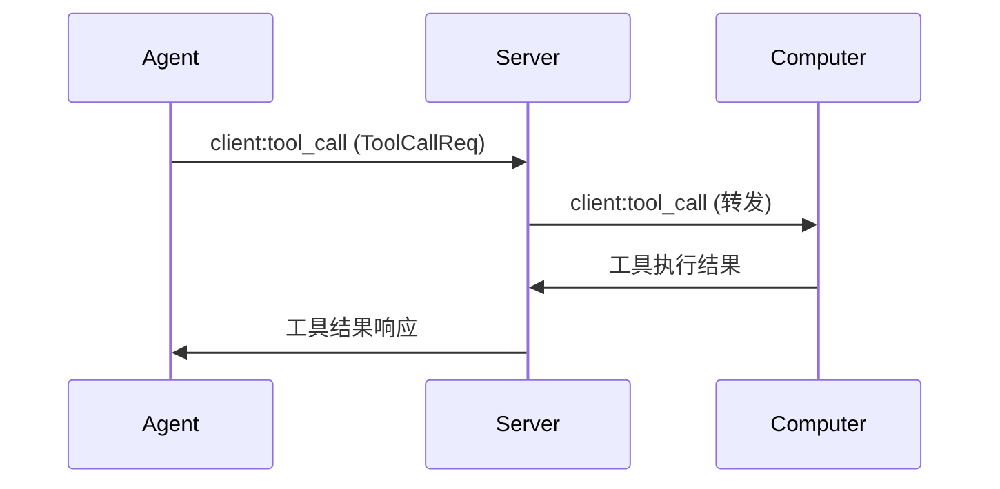
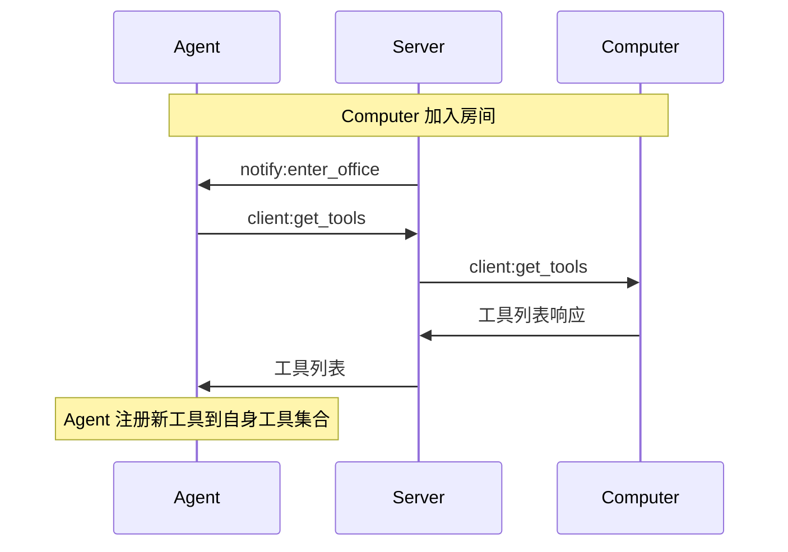

# A2C-SMCP: Agent to Computer SMCP Protocol Specification (Release Candidate)

> Status: **Release Candidate (RC)**  \
> Version: 0.1.2-rc1  \
> Last-Updated: 2025-12-10

本规范文档以接近 IETF RFC 的风格，对 A2C-SMCP 协议进行形式化描述，用于指导实现者在不同平台和语言上实现**互操作的 Agent ⇄ Computer 远程调用协议**。

---

## 1. 引言（Introduction）

A2C-SMCP（Agent To Computer SMCP）协议定义了一种在 Agent 与承载多路 MCP Server 的 Computer 之间进行远程工具调用的应用层通信机制。该协议运行在 Socket.IO 之上，以事件为基础组织消息，并通过房间（Room）机制实现安全隔离。

本规范旨在解决传统 MCP 协议在复杂 Agent 系统中的以下关键问题：

- **多 MCP 服务管理困难**：在同一主机或多主机环境中管理多个 MCP Server 的生命周期与路由。
- **工具权限与安全挑战**：Token 泄露、证书归属、网络暴露等企业级安全问题。
- **网络连接与穿透**：在 NAT、防火墙、代理等复杂网络环境中维持稳定长连接。

本协议通过引入 **Computer** 概念，将 MCP Server 管理能力上收，并通过 **Server** 统一路由 Agent 与 Computer 之间的信令，实现可扩展的远程工具调用体系。

---

## 2. 术语与规范性约定（Terminology and Conventions）

### 2.1 术语（Terminology）

本规范中使用下列术语：

- **Agent**  
  工具调用的发起方，通常为智能体、机器人等。每个 Agent 在协议中通过 `agent` 字段（Agent 标识）与 `office_id`（房间标识）进行标识。

- **Computer**  
  MCP Server 的宿主与统一管理者。一个 Computer 可以管理多个 MCP Server，并对外暴露统一的工具视图。协议中通过 `computer` 标识（字符串）。

- **Server**  
  信令服务器，负责管理连接、房间（office）、事件路由与广播通知。实现上通常为 Socket.IO Server。

- **Room / Office**  
  逻辑隔离单元，用于约束 Agent 与 Computer 的协作范围。本规范中使用 `office_id` 作为房间标识，并约定：
  - 每个房间在全局 MUST 具备唯一 `office_id`；
  - 一个房间内至多包含一个 Agent 和若干 Computer；
  - 一个 Agent 在同一时刻 MUST 只加入一个房间（通过 `AgentConfig.office_id` 与房间绑定）。

- **Event**  
  通过 Socket.IO 命名空间 `/smcp` 发送的消息单元，采用字符串事件名 + JSON 负载的形式。本规范将事件划分为三大类：`client:`、`server:`、`notify:`。

- **MCP Server**  
  遵循 MCP 协议的工具服务端，可通过 stdio、HTTP、SSE 等模式运行，由 Computer 负责管理其生命周期与调用。

### 2.2 规范性语言（Normative Language）

本规范中的以下关键字：

> 英文 / English: "MUST", "MUST NOT", "REQUIRED", "SHALL", "SHALL NOT", "SHOULD", "SHOULD NOT", "RECOMMENDED", "MAY", "OPTIONAL"  \
> 中文 / Chinese（对应含义，仅为辅助理解，不参与协议匹配）: 「必须」「不得」「需要」「应当」「不应」「应该」「不应该」「推荐」「可以」「可选」

应按 RFC 2119 / RFC 8174 中对英文关键字的描述进行解释。中文关键字仅用于帮助中文读者理解，不改变英文关键字的规范性含义。

- 含有上述英文关键字的语句为**规范性要求（Normative）**，实现 **必须/应该/可以** 遵循。
- 其他说明性文字仅用于解释与示例，不具备强制约束力。

---

## 3. 协议总体模型（Protocol Overview）

### 3.1 角色与关系（Roles）

下表总结了协议中的角色与数量约束：

| 角色 | 数量约束 | 描述 | 连接特性 |
|------|----------|------|----------|
| **Computer** | 多台（≥1） | MCP Server 宿主与工具提供者 | 与单一 `office_id` 绑定 |
| **Agent** | 每个房间最多 1 个 | 工具调用发起方 | 可以参与多个房间 |
| **Server** | 全局 1 台（逻辑） | 信令与路由中枢 | 管理所有连接与房间 |

### 3.2 命名空间与传输（Namespace and Transport）

- 协议运行在 Socket.IO 传输层之上。底层传输 **MAY** 为 WebSocket、HTTP 长轮询等，由 Socket.IO 实现决定。
- 所有协议事件 **MUST** 通过命名空间：

```python
SMCP_NAMESPACE = "/smcp"
```

发送与接收。

### 3.3 事件分类（Event Categories）

事件名称采用前缀约定，用于区分来源与语义：

| 类别 | 前缀 | 方向 | 典型示例 |
|------|------|------|----------|
| **工具操作类（Client Events）** | `client:` | Agent → Computer | `client:tool_call` |
| **房间与配置管理（Server Events）** | `server:` | Agent/Computer → Server | `server:join_office` |
| **通知广播（Notify Events）** | `notify:` | Server → Agent/Computer（广播） | `notify:enter_office` |

实现者 **MUST NOT** 在同一命名空间内复用这些前缀用于其他非本规范定义的语义，除非有向后兼容的扩展约定（见第 9 章）。

---

## 4. 房间与隔离模型（Room and Isolation Model）

### 4.1 房间标识（Office ID）

- 每个房间使用 `office_id` 字符串作为唯一标识。
- `office_id` 同时也出现在 Agent 配置中（`AgentConfig.office_id`），用于在客户端侧绑定「当前活跃房间」。实现时 **SHOULD** 保证 Agent 使用的 `office_id` 与其实际加入的房间保持一致，以简化权限校验与问题排查。

### 4.2 加入流程（Join Office Flow）

加入流程通过 `server:join_office` 事件实现，其典型时序如下：



Server **MUST** 至少执行以下校验：

- 校验 `office_id` 合法性（格式与授权范围）。
- 根据连接身份（Agent/Computer）决定能否加入目标房间。

### 4.3 成员变更通知（Membership Notifications）

当房间成员发生变化时，Server **MUST** 发送通知事件：

- `notify:enter_office`：有 Agent 或 Computer 加入房间；
- `notify:leave_office`：有 Agent 或 Computer 离开房间。

通知负载数据结构示例如下（Python 类型表示，仅为说明）：

```python
class EnterOfficeNotification(TypedDict, total=False):
    office_id: str
    computer: Optional[str]  # 新加入的 Computer
    agent: Optional[str]     # 新加入的 Agent

class LeaveOfficeNotification(TypedDict, total=False):
    office_id: str
    computer: Optional[str]  # 离开的 Computer
    agent: Optional[str]     # 离开的 Agent
```

### 4.4 隔离与约束（Isolation Guarantees）

Server **MUST** 实现至少以下隔离约束：

| 限制类型 | 触发条件 | 服务端行为（规范性要求） |
|---------|----------|---------------------------|
| **Agent 独占** | 某房间已有 Agent 时，另一个 Agent 尝试加入同一 `office_id` | Server MUST 拒绝新 Agent 加入请求，并 SHOULD 返回错误码 `403` |
| **Computer 绑定** | 同一个 Computer 尝试加入新的房间 | Server MUST 自动将其从旧房间移除或断开旧关联 |
| **跨房间访问禁止** | 来自某房间的事件试图访问其他房间资源 | Server MUST NOT 将事件路由到非当前 `office_id` 房间内的成员 |

---

## 5. 消息与数据结构（Messages and Data Structures）

### 5.1 通用约定（Common Conventions）

- 所有事件负载 **MUST** 为 JSON 对象。
- 字段命名 **SHOULD** 使用下划线风格（`snake_case`）。
- 时间与超时时间字段 **SHOULD** 使用整数秒或 RFC3339 字符串，具体约定需在具体字段描述中明确。

> 注意：虽然 MCP 协议中的 `MCPServerInput` 在不同实现（不同语言 SDK 或 Client）中的格式可能存在差异，但 A2C-SMCP 仅依赖其在 **当前 Computer 实现中的解释**。Agent 实现者在使用时 **SHOULD** 仔细阅读对应 Computer / MCP 客户端文档。

### 5.2 工具调用请求（ToolCallReq）

在代码中，工具调用请求通过 `AgentCallData` 与 `ToolCallReq` 组合建模：

```python
class AgentCallData(TypedDict):
    agent: str  # Agent 标识（agent name / id）
    req_id: str # 请求 ID


class ToolCallReq(AgentCallData):
    computer: str     # 目标 Computer 标识
    tool_name: str    # 工具名称
    params: dict      # 调用参数（MCP 工具参数）
    timeout: int      # 调用超时时间（秒）
```

规范性要求：

- `req_id` 在同一 `agent` 作用域内 **MUST** 唯一，用于去重与幂等处理。
- `timeout` 为 Agent 期望的上限，Computer **SHOULD** 在此时间内完成工具调用或显式返回超时错误。

### 5.3 MCP 配置结构（MCPServerConfig）

```python
class MCPServerConfig(TypedDict):
    type: Literal["stdio", "http", "sse"]
    url: NotRequired[str]          # HTTP/SSE 模式必需
    command: NotRequired[str]      # 命令行（stdio）模式必需
    disabled: bool                 # 是否禁用
    tool_meta: dict[str, dict]     # 工具元数据
```

规范性要求：

- 当 `type == "http" or type == "sse"` 时，`url` 字段 **MUST** 存在且为合法 URL。
- 当 `type == "stdio"` 时，`command` 字段 **MUST** 存在且可被目标系统执行。
- 当 `disabled == true` 时，对应 MCP Server **MUST NOT** 被纳入可调用工具集合。

---

## 6. 核心事件定义（Core Events）

本节对主要事件进行规范性定义，事件名、方向与负载结构在实现中 **MUST** 保持一致，以确保互操作性。

### 6.1 工具相关事件（Tools-related Events）

| 事件名称 | 方向 | 发起方 | 描述 |
|----------|------|--------|------|
| `client:tool_call` | Agent → Server → Computer | Agent | 工具调用请求 |
| `client:get_mcp_config` | Agent → Server → Computer | Agent | 获取 MCP 配置 |
| `client:get_tools` | Agent → Server → Computer | Agent | 获取工具列表 |
| `server:tool_call_cancel` | Agent → Server → Computer | Agent | 取消工具调用请求 |
| `notify:tool_call_cancel` | Server → Agent/Computer（广播） | Server | 工具调用被取消通知 |

实现要求摘要：

- `client:tool_call` 的负载 **MUST** 为 `ToolCallReq`；
- `server:tool_call_cancel` **MUST** 标识目标 `req_id` 与相关元数据；
- 当 Server 成功处理取消请求时，**SHOULD** 发送 `notify:tool_call_cancel` 至相关参与者（至少包含原 Agent 与对应 Computer）。

### 6.2 Desktop 相关事件（Desktop-related Events）

| 事件名称 | 方向 | 发起方 | 描述 |
|----------|------|--------|------|
| `client:get_desktop` | Agent → Server → Computer | Agent | 获取桌面信息请求 |
| `server:desktop_refresh` | Computer → Server → Agent | Computer | 请求服务端刷新桌面快照 |
| `notify:desktop_refresh` | Server → Agent/Computer（广播） | Server | 桌面刷新通知 |

Desktop 相关数据结构与语义在单独的 Desktop 子规范中 **MAY** 得到进一步扩展，本规范仅定义事件名称和方向约束。

### 6.3 状态变更事件（Status and Membership Events）

| 事件名称 | 方向 | 发起方 | 描述 |
|----------|------|--------|------|
| `server:join_office` | Agent/Computer → Server | Agent/Computer | 加入房间 |
| `server:leave_office` | Agent/Computer → Server | Agent/Computer | 离开房间 |
| `server:update_mcp_config` | Computer → Server → Agent | Computer | 更新 MCP 配置 |
| `notify:enter_office` | Server → Agent/Computer（广播） | Server | 成员加入通知 |
| `notify:leave_office` | Server → Agent/Computer（广播） | Server | 成员离开通知 |
| `notify:update_mcp_config` | Server → Agent/Computer（广播） | Server | MCP 配置更新通知 |

实现要求摘要：

- `server:join_office` 和 `server:leave_office` 的负载 **MUST** 至少包含 `office_id` 与连接身份信息；
- 当 MCP 配置更新时，Server **SHOULD** 发送 `notify:update_mcp_config` 给同房间的 Agent，使其刷新本地工具列表与配置缓存。

---

## 7. 交互流程（Interaction Flows）

### 7.1 工具调用流程（Tool Invocation Flow）



实现要求：

1. Agent 发送 `client:tool_call` 时 **MUST** 确保自身已加入目标 `office_id` 对应房间。
2. Server 在转发请求前 **MUST** 验证：
   - Agent 与目标 Computer 是否在同一 `office_id` 房间；
   - 对应工具是否处于可用状态（未被禁用，MCP 配置合法）。
3. Computer 收到请求后 **SHOULD** 在 `timeout` 限定时间内返回结果或显式超时错误。

### 7.2 动态工具发现（Dynamic Tool Discovery）



Agent 实现 **SHOULD** 在收到 `notify:enter_office` 后自动执行一次 `client:get_tools`，以获取新加入 Computer 提供的工具列表，并相应更新自身工具能力视图。

---

## 8. 错误处理（Error Handling）

> 说明：本章节目前为草案状态，具体错误码与结构仍在演进中。

### 8.1 错误代码表（Error Codes）

实现 **SHOULD** 使用以下通用错误码：

| 代码 | 含义 | 典型触发场景 |
|------|------|--------------|
| 400 | 无效请求格式 | 数据结构校验失败、字段缺失或类型错误 |
| 403 | 权限违规 | 跨房间访问、Agent 独占冲突、未授权操作 |
| 404 | 资源不存在 | 工具或 Computer 不存在、MCP 配置缺失 |
| 408 | 请求超时 | 工具调用超过约定超时时间未返回 |
| 500 | 内部错误 | Server 或 Computer 端逻辑异常 |

### 8.2 错误响应格式（Error Response Format）

错误响应主体 **SHOULD** 采用如下结构：

```json
{
  "error": {
    "code": 404,
    "message": "请求的工具不存在",
    "details": {
      "toolId": "invalid-tool-id"
    }
  }
}
```

- `code` 字段 **MUST** 是整数错误码；
- `message` **SHOULD** 为人类可读的简短描述（推荐中文）；
- `details` **MAY** 包含结构化调试信息，但 **MUST NOT** 泄露敏感凭证（如 Token、密钥、内部 IP 等）。

---

## 9. 扩展性与版本管理（Extensibility and Versioning）

### 9.1 事件扩展（Event Extension）

- 实现者 **MAY** 在保证向后兼容的前提下，新增带有新前缀或子前缀的事件，例如：`client:x_custom_action`；
- 新增事件 **SHOULD NOT** 复用本规范已定义事件名，以避免语义冲突；
- 对于未知事件，实现 **MUST** 至少做到：
  - Agent/Computer 端可以安全忽略未知 `notify:` 事件；
  - Server 端对未知 `client:` / `server:` 事件 **SHOULD** 返回 400 错误并记录日志。

### 9.2 字段扩展（Field Extension）

- 新增字段 **SHOULD** 遵循“可选字段 + 默认行为”的模式：
  - 未提供该字段的旧客户端/服务端仍能正常工作；
  - 默认行为应尽量等价于“未启用该新特性”。
- 对于 JSON 负载，接收方 **MUST** 能够安全忽略未知字段。

### 9.3 协议版本（Protocol Versioning）

推荐（RECOMMENDED）在连接握手或首个事件中显式携带协议版本，例如：

```json
{
  "protocol": "a2c-smcp",
  "version": "0.1.0"
}
```

- 当 Major 版本号变化（例如 1.x → 2.x）时，**MAY** 引入不兼容更改；
- Server **SHOULD** 在检测到版本不兼容时拒绝连接或返回明确错误。

---

## 10. 安全性考虑（Security Considerations）

实现 A2C-SMCP 协议时，至少应关注以下安全点：

1. **传输安全**  
   - 在公网或不可信网络上部署时，Agent 与 Server 之间的连接 **MUST** 通过 TLS 保护；
   - 需要端到端保密的场景 **SHOULD** 进一步采用 mTLS 或上层加密方案。

2. **凭证与 Token 管理**  
   - 敏感 Token **MUST NOT** 在 Agent 与 Server 之间明文传播；
   - 推荐将凭证仅存储于 Computer 本地，由 Computer 代为调用外部系统（“零凭证传播”）。

3. **房间与角色授权**  
   - Server **MUST** 对房间加入与离开事件执行严格的身份与权限校验；
   - 对于违反房间隔离约束的请求，**MUST NOT** 进行路由，并 **SHOULD** 记录安全审计日志。

4. **资源滥用与 DoS 防护**  
   - 实现 **SHOULD** 对工具调用频率、并发数与超时时间设置合理上限；
   - 在遭遇异常高流量时，**MAY** 触发限流、降级或临时拒绝服务策略。

---

## 11. 参考实现（Informative, Non-Normative）

本章节为**说明性（Informative）**内容，仅用于帮助理解，不对实现者构成强制约束。

### 11.1 Server 端示意结构（Python）

```python
class SMCPNamespace(TFRSNamespace):
    async def on_server_join_office(self, sid, data):
        # 实现房间加入逻辑 / Implement office join logic
        ...

    async def on_client_tool_call(self, sid, data):
        # 路由工具调用请求 / Route tool call request
        ...

    async def enter_room(self, sid, room):
        # 房间加入核心实现 / Core room enter implementation
        ...
```

### 11.2 Agent 客户端示意结构（Python）

```python
class SMCPAgentClient(Client):
    def emit_tool_call(self, computer, tool_name, params, expires):
        # 发送工具调用请求 / Send tool call request
        ...

    def on_computer_enter_office(self, data):
        # 处理新 Computer 通知 / Handle new computer notification
        # 自动获取工具列表并注册 / Auto fetch and register tools
        ...

    def on_computer_update_mcp_config(self, data):
        # 处理 MCP 配置更新 / Handle MCP config update
        # 刷新本地工具集合 / Refresh local tools
        ...
```

---

## 12. 附录：完整事件列表（Appendix: Full Event List）

下表汇总了当前规范所涵盖的全部事件（与 `docs/index.md` 中保持一致），供实现者快速查阅：

| 事件名称 | 方向 | 描述 | 负载结构（示意） |
|----------|------|------|------------------|
| `client:tool_call` | A→C | 工具调用请求 | `ToolCallReq` |
| `client:get_tools` | A→C | 获取工具列表 | `GetToolsReq` |
| `client:get_mcp_config` | A→C | 获取 MCP 配置 | `GetMCPConfigReq` |
| `client:get_desktop` | A→C | 获取桌面信息 | `GetDesktopReq` |
| `server:join_office` | A/C→S | 加入房间 | `EnterOfficeReq` |
| `server:leave_office` | A/C→S | 离开房间 | `LeaveOfficeReq` |
| `server:update_mcp_config` | C→S | 更新 MCP 配置 | `UpdateMCPConfigReq` |
| `server:tool_call_cancel` | A→S | 取消工具调用 | `ToolCallCancelReq`/`AgentCallData` |
| `notify:tool_call_cancel` | S→广播 | 工具调用取消通知 | `ToolCallCancelNotification`/`AgentCallData` |
| `server:desktop_refresh` | C→S | 刷新桌面请求 | `DesktopRefreshReq` |
| `notify:desktop_refresh` | S→广播 | 桌面刷新通知 | `DesktopRefreshNotification` |
| `notify:enter_office` | S→广播 | 成员加入通知 | `EnterOfficeNotification` |
| `notify:leave_office` | S→广播 | 成员离开通知 | `LeaveOfficeNotification` |

本表中的数据结构名称为说明性标识，具体定义可参考代码实现与 SDK 文档。
