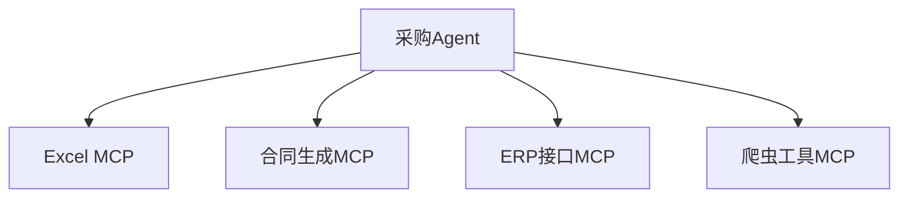
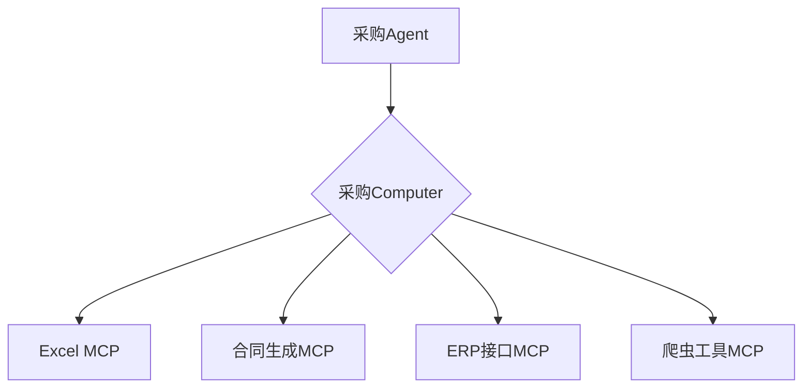
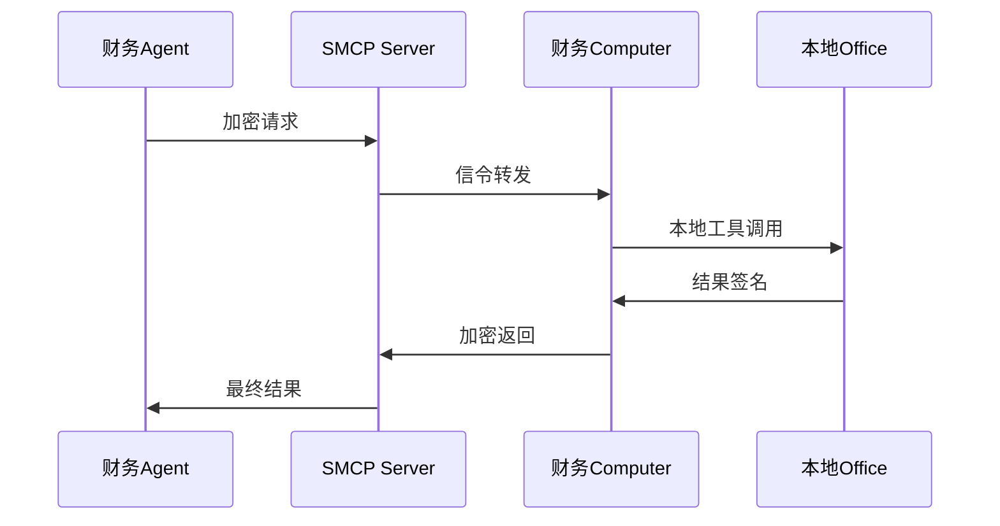
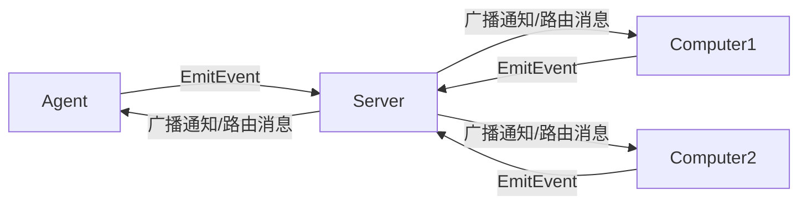
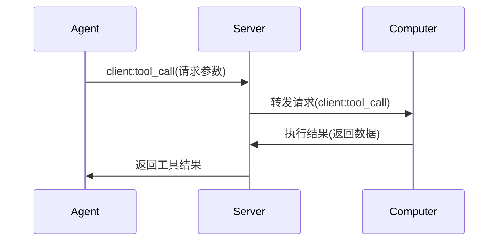
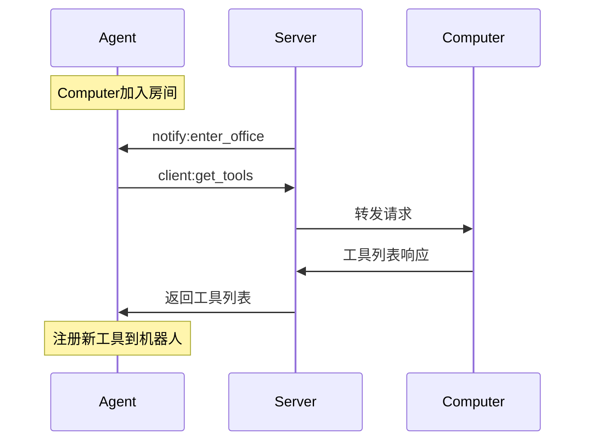

# A2C-SMCP远程调用协议 (Agent To Computer SMCP)

## 设计目标与背景

A2C-SMCP（旨在解决MCP协议在Agent系统中的核心痛点：

1. **多MCP服务管理问题**  
   引入`Computer`概念统一管理主机上的多个MCP服务，简化Agent与多工具服务交互

2. **工具权限与安全挑战**  
   - 工具鉴权（如Token过期/权限过高问题）
   - 证书管理（如Office版权归属问题）
   - 网络依赖（跨域请求、内网穿透、代理管理）

A2C-SMCP 通过在 Agent 与工具之间引入“Computer”概念，有效简化了 Agent 对多工具的统一管理，以及在安全性和版权方面所面临的挑战。`Computer` 
的具体实现基于 MCP 协议，因此理论上，工具开发者只需实现 MCP 协议即可，无需额外适配(原MCP Server开发者不需要做任何改动)。

A2C-SMCP 协议主要由 Agent 开发者进行集成和定制，工具开发者无需关注协议的具体实现细节。同时，Agent 开发者也无需担心与框架的深度耦合问题。协议
经过精心设计，仅需在 Agent 框架中实现协议规定的部分接口即可完成对接，A2C-SMCP 不会对 Agent 框架的选型等做出强制要求。

A2C-SMCP 旨在解决传统MCP协议在复杂Agent系统中面临的关键挑战。我们通过两个核心场景说明设计动机：

### 场景1：工具服务海啸问题（多MCP管理困境）
**背景示例**  
某企业AI团队开发的采购Agent需要协调：
- 本地Excel工具（处理采购清单）
- 云端合同生成服务
- 内部ERP系统接口
- 供应商比价爬虫工具

**MCP痛点**  

- 🤯 **管理黑洞**：Agent需单独维护每个MCP的生命周期
- 💔 **断连风险**：任一MCP崩溃导致整个采购流程失败
- 🚫 **资源浪费**：空闲MCP持续占用系统资源

**SMCP解决方案**  

- 🛡️ **故障隔离**：单个MCP崩溃不影响Computer整体
- 📡 **热插拔支持**：动态增删工具无需重启Agent
- ⚙️ **统一监护**：Computer内部实施服务健康监测

---

### 场景2：企业级工具安全困境
**敏感工具案例**  
财务部门需要：
- ⚖️ 用本地安装的Office处理报表（版权限制）
- 🔑 通过VPN访问银行系统（双因素认证）
- 📊 操作SAP财务模块（角色权限管理）

**传统MCP缺陷**  

| 安全问题 | 后果示例 | 发生频率 |
|----------|----------|----------|
| **硬编码Token** | 财务Token泄露造成百万损失 | 高危 ⚠️ |
| **公网暴露端口** | SAP接口遭勒索软件攻击 | 频发 🔥 |
| **证书冲突** | 多用户共享Office触发版权审计 | 中危 ⚠️ |

**SMCP安全架构**  

关键保护层：
1. 🔐 **零凭证传播**：敏感Token仅存在本地Computer
2. 🌐 **无公网暴露**：Computer通过长连接主动对接
3. 🏷️ **设备绑定**：Office许可证与特定Computer硬件绑定

---

### 核心解决方案

| 问题类型 | A2C-SMCP解决方案 |
|---------|-----------------|
| **多服务管理** | Computer抽象层聚合多个MCP服务 |
| **权限安全** | 房间隔离+角色绑定机制 |
| **网络穿透** | Socket.IO长连接+信令服务器 |
| **证书管理** | Computer绑定物理设备所有权 |

## 协议基础设计

### 角色定义

| 角色 | 数量限制 | 描述 | 连接特性 |
|------|---------|------|---------|
| **Computer** | 多台(≥1) | 工具服务提供者(MCP宿主) | 单房间绑定 |
| **Agent** | 1台/房间 | 工具调用发起方 | 多房间支持 |
| **Server** | 1台 | 信令服务器(连接管理+消息路由) | 全局中枢 |

### 核心交互模型


### 命名空间设计
```python
# 核心协议命名空间
SMCP_NAMESPACE = "/smcp"

# 事件类别规则:
# client:  Agent发起→Computer执行
# server:  客户端发起→Server处理
# notify:  Server发起→广播通知
```

## 房间(Room)机制

### 房间管理规范

1. **房间标识**  
   `office_id` = `robot_id` (确保全局唯一性)
   
2. **加入流程**  
   ```mermaid
   sequenceDiagram
       participant C as Computer/Agent
       participant S as Server
       C->>S: server:join_office
       S->>S: 校验角色权限
       alt 校验通过
           S->>C: 加入房间
           S->>Room: notify:enter_office
       else 校验失败
           S->>C: 返回错误
       end
   ```

3. **成员变更通知**

   ```python
   # 加入通知结构
   class EnterOfficeNotification(TypedDict, total=False):
       office_id: str
       computer: Optional[str]  # 新加入的Computer
       agent: Optional[str]     # 新加入的Agent

   # 离开通知结构
   class LeaveOfficeNotification(TypedDict, total=False):
       office_id: str
       computer: Optional[str]  # 离开的Computer
       agent: Optional[str]     # 离开的Agent
   ```

### 隔离保障机制

| 限制类型 | 触发条件 | 服务端响应 |
|---------|---------|-----------|
| **Agent独占** | 房间已有Agent时新Agent加入 | `Agent sid should be equal to office_id` |
| **Computer绑定** | Computer尝试加入新房间 | 自动断开旧房间 |
| **权限边界** | 跨房间访问请求 | 自动拒绝路由 |

## 消息协议规范

### 事件分类体系

| 类别 | 前缀 | 方向 | 示例 |
|------|------|------|------|
| **工具操作** | `client:` | Agent→Computer | `client:tool_call` |
| **房间管理** | `server:` | 客户端→Server | `server:join_office` |
| **状态通知** | `notify:` | Server→广播 | `notify:enter_office` |

### 核心事件列表

#### Tools相关事件 / Tools-related events

| 事件名称 | 发起方 | 描述 | 数据结构 |
|---------|--------|------|----------|
| `client:tool_call` | Agent | 工具调用请求<br>Tool call request | `ToolCallReq` |
| `client:get_mcp_config` | Agent | 获取MCP配置<br>Get MCP config | `GetMCPConfigReq` |
| `client:get_tools` | Agent | 获取工具列表<br>Get tools list | `GetToolsReq` |
| `server:tool_call_cancel` | Agent | 取消工具调用请求<br>Cancel tool call request | `ToolCallCancelReq` |
| `notify:tool_call_cancel` | Server | 工具调用被取消通知<br>Tool call canceled notification | `ToolCallCancelNotification` |

#### Desktop相关事件 / Desktop-related events

| 事件名称 | 发起方 | 描述 | 数据结构 |
|---------|--------|------|----------|
| `client:get_desktop` | Agent | 获取桌面信息请求<br>Get desktop info request | `GetDesktopReq` |
| `server:desktop_refresh` | Computer | 请求服务端刷新桌面快照<br>Request server to refresh desktop snapshot | `DesktopRefreshReq` |
| `notify:desktop_refresh` | Server | 桌面刷新通知<br>Desktop refreshed notification | `DesktopRefreshNotification` |

#### 状态变更相关事件 / Status change related events

| 事件名称 | 发起方 | 描述 | 数据结构 |
|---------|--------|------|----------|
| `server:join_office` | Computer/Agent | 加入房间请求<br>Join office request | `EnterOfficeReq` |
| `server:leave_office` | Computer/Agent | 离开房间请求<br>Leave office request | `LeaveOfficeReq` |
| `server:update_mcp_config` | Computer | 更新MCP配置请求<br>Update MCP config request | `UpdateMCPConfigReq` |
| `notify:enter_office` | Server | 成员加入通知<br>Member entered notification | `EnterOfficeNotification` |
| `notify:leave_office` | Server | 成员离开通知<br>Member left notification | `LeaveOfficeNotification` |
| `notify:update_mcp_config` | Server | 配置更新通知<br>Config updated notification | `UpdateMCPConfigNotification` |

### 核心数据结构

*!需要注意的是 MCPServerInput 虽然数据结构定义是统一的，但在不同语言的SDK里，或者不同语言实现的Client中，其格式可能不一致。因此需要重点关注使用客户端的相关文档说明。*

```python
# 工具调用请求
class ToolCallReq(TypedDict):
    robot_id: str     # Agent标识
    req_id: str       # 请求UUID
    computer: str     # 目标Computer
    tool_name: str    # 工具名称
    params: dict      # 调用参数
    timeout: int      # 超时时间(秒)

# MCP配置结构
class MCPServerConfig(TypedDict):
    type: Literal["stdio", "http", "sse"]
    url: NotRequired[str]          # HTTP/SSE模式必需
    command: NotRequired[str]      # 命令行模式必需
    disabled: bool                # 是否禁用
    tool_meta: dict[str, dict]    # 工具元数据
```

## 核心交互流程

### 工具调用流程


### 动态工具发现


## 错误处理规范（TODO 尚未实现 | 以下标准也正在讨论中）

### 错误代码表

| 代码 | 含义 | 触发场景 |
|------|------|---------|
| 400 | 无效请求格式 | 数据结构校验失败 |
| 403 | 权限违规 | 角色限制冲突 |
| 404 | 资源不存在 | 工具/Computer不存在 |
| 408 | 请求超时 | 操作执行超时 |
| 500 | 内部错误 | 服务端异常 |

### 错误响应格式
```python
{
  "error": {
    "code": 404,
    "message": "请求的工具不存在",
    "details": {
      "toolId": "invalid-tool-id"
    }
  }
}
```

## 协议实现架构（以Python为例）

### Server架构
```python
class SMCPNamespace(TFRSNamespace):
    async def on_server_join_office(self, sid, data):
        # 实现房间加入逻辑
        
    async def on_client_tool_call(self, sid, data):
        # 路由工具调用请求
        
    async def enter_room(self, sid, room):
        # 房间加入的核心实现
        if role == "agent":
            # Agent单房间校验
        else:
            # Computer房间切换处理
```

### Agent客户端
```python
class SMCPAgentClient(Client):
    def emit_tool_call(self, computer, tool_name, params, expires):
        # 发送工具调用请求
        
    def on_computer_enter_office(self, data):
        # 处理新Computer通知
        # 自动获取工具列表并注册
        
    def on_computer_update_mcp_config(self, data):
        # 处理配置更新
        # 刷新工具集
```

## 协议优势总结

1. **工具热管理**  
   - 动态发现/注册工具
   - 配置热更新支持

2. **安全隔离**  
   - Agent-Computer 1:1绑定
   - 基于房间的权限边界

3. **网络穿透优化**  
   - Socket.IO长连接
   - 免除公网IP依赖

4. **弹性架构**  
   - 多Computer支持
   - 分布式工具部署

5. **标准化接口**  
   - 强类型数据结构
   - 明确的事件边界

## 附录：完整事件列表

| 事件名称 | 方向    | 描述     | 数据结构 |
|----------|-------|--------|---------|
| `client:tool_call` | A→C   | 工具调用请求 | `ToolCallReq` |
| `client:get_tools` | A→C   | 获取工具列表 | `GetToolsReq` |
| `client:get_mcp_config` | A→C   | 获取MCP配置 | `GetMCPConfigReq` |
| `client:get_desktop` | A→C   | 获取桌面信息 | `GetDesktopReq` |
| `server:join_office` | A/C→S | 加入房间 | `EnterOfficeReq` |
| `server:leave_office` | A/C→S | 离开房间   | `LeaveOfficeReq` |
| `server:update_mcp_config` | C→S   | 更新配置请求 | `UpdateMCPConfigReq` |
| `server:tool_call_cancel` | A→S  | 取消工具调用 | `AgentCallData` |
| `notify:tool_call_cancel` | S→广播  | 取消工具调用 | `AgentCallData` |
| `server:desktop_refresh` | C→S  | 刷新桌面请求 | `DesktopRefreshReq` |
| `notify:desktop_refresh` | S→广播 | 桌面刷新通知 | `DesktopRefreshNotification` |
| `notify:enter_office` | S→广播  | 成员加入通知 | `EnterOfficeNotification` |
| `notify:leave_office` | S→广播  | 成员离开通知 | `LeaveOfficeNotification` |


## Roadmap

- 实现对错误处理模式的定义与实现
- 实现对 Desktop 事件与数据结构的管理与落地，支持桌面信息获取与刷新通知。
- 实现对 MCP 协议中 Prompts 的管理，方便Agent使用。
- 实现与OpenTelemetry的集成，支持将A2C-SMCP调用链的数据连接到目前的用户请求调用链（触发A2C协议的请求）
